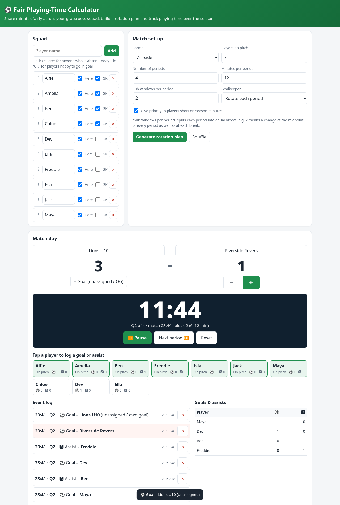

# Fair Play Calculator

A single-page, offline-capable web app (installable PWA) for grassroots football coaches:

- **Fair playing time** – squad list (drag to reorder, mark absent / GK-able), match format, periods and sub windows; generates a rotation plan that shares minutes evenly, avoids anyone sitting out twice in a row, and locks each period's goalkeeper on for the whole period. Drag or tap to swap players manually.
- **Match day** – stopwatch (survives reloads), tap a player to log goals and assists with timestamps, away score +/−, event log with undo.
- **Season tracker** – saves minutes, goals and assists per match; shows season totals and who should get extra time next game.
- Print-friendly plan. All data stays in your browser (localStorage).

## Use / install
Open `index.html` (or the GitHub Pages URL) and use your browser's “Install app” / “Add to Home Screen”.

## Releasing an update
Bump `VERSION` in `sw.js`; open copies will show a “Reload to update” prompt.
